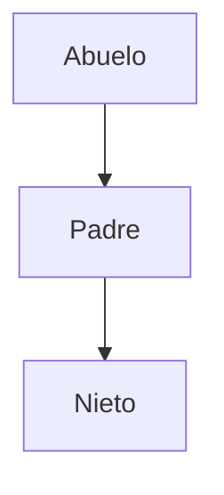

# Guía para Identificar Relaciones entre Componentes

Para elegir el patrón de comunicación correcto (Props, Context, Store), primero debes saber **qué son** tus componentes entre sí (Padre, Hijo, Hermano).

🚨 **REGLA DE ORO:** La relación **NO** depende de en qué carpeta están los archivos. Depende exclusivamente de **quién importa y renderiza a quién** dentro del código (JSX).

---

## 1. El Concepto del "Árbol de Componentes"

Imagina tu aplicación como un árbol genealógico.

*   **Importar** un componente es como "adoptarlo".
*   **Renderizarlo** en el JSX (`<Componente />`) es hacerlo parte de tu familia activa.

### 🆚 Carpetas vs. Renderizado

Mira este ejemplo. Aunque los archivos estén en carpetas muy lejanas, la relación es directa.

**Estructura de Archivos (Lo que ves en el explorador):**
```text
src/
├── pages/
│   └── Dashboard/
│       └── DashboardPage.tsx  <-- Archivo A
└── components/
    └── ui/
        └── Button.tsx         <-- Archivo B
```

**Código en `DashboardPage.tsx`:**
```tsx
import { Button } from '@/components/ui/Button'; // Importación

export function DashboardPage() {
  return (
    <div>
      <h1>Hola</h1>
      <Button />  {/* Renderizado */}
    </div>
  );
}
```

**Relación Real:**
*   `DashboardPage` es el **PADRE**.
*   `Button` es el **HIJO**.
*   **No importa** que uno esté en `pages` y otro en `components`.

---

## 2. Cómo Identificar al Padre y al Hijo

### 🔍 Cómo detectarlo:
Busca la sentencia `return` (el JSX).

*   **Padre:** Es el componente que contiene el código.
*   **Hijo:** Es la etiqueta `<... />` que está escrita dentro.

```tsx
function Padre() {
  return (
    <section>
      <Hijo />  {/* Soy el Hijo porque estoy dentro del return del Padre */}
    </section>
  );
}
```

### 🛠 Qué patrón usar:
*   **Padre a Hijo:** Usa **Props**.
*   **Hijo a Padre:** Usa **Callbacks** (funciones pasadas por props).

---

## 3. Cómo Identificar a los Hermanos (Siblings)

### 🔍 Cómo detectarlo:
Dos componentes son hermanos si **viven dentro del mismo `return`** de otro componente (su padre).

```tsx
function PadreComun() {
  return (
    <main>
      <Header />   {/* Hermano Mayor */}
      <Sidebar />  {/* Hermano del Medio */}
      <Content />  {/* Hermano Menor */}
    </main>
  );
}
```

Aquí `Header`, `Sidebar` y `Content` son **Hermanos**, aunque `Header` esté en una carpeta y `Sidebar` en otra. Lo que los hace hermanos es que `PadreComun` los renderiza juntos.

### 🛠 Qué patrón usar:
*   **Hermano a Hermano:** No pueden hablarse directamente. Usa **Lifting State Up** (sube el estado al `PadreComun`).

---

## 4. Abuelos, Nietos y "Familia Lejana"

Esto ocurre cuando hay niveles intermedios.

**Código:**
```tsx
// Abuelo.tsx
function Abuelo() {
  return <Padre />;
}

// Padre.tsx
function Padre() {
  return <Nieto />;
}

// Nieto.tsx
function Nieto() {
  return <div>Soy el nieto</div>;
}
```

**El Árbol:**


*   `Abuelo` renderiza a `Padre`.
*   `Padre` renderiza a `Nieto`.
*   Por tanto, `Nieto` está dentro de `Abuelo` indirectamente.

### 🛠 Qué patrón usar:
*   Si `Abuelo` quiere pasar algo a `Nieto`:
    *   Si es solo 1 nivel intermedio: Puedes usar **Props** (pasando por el Padre).
    *   Si son muchos niveles (Bisabuelo -> Tataranieto): Usa **Context API** o **Zustand**.

---

## 5. Ejemplo Visual Complejo

Analicemos tu proyecto actual (`FormsListPage`).

```tsx
// FormsListPage.tsx (El "Dueño de la casa")
export function FormsListPage() {
  return (
    <div>
      <FormsHeader />      {/* Hijo 1 */}
      
      <div>
        {forms.map(f => (
           <FormCard />    {/* Hijo 2 (multiplicado) */}
        ))}
      </div>

      <FormsStats />       {/* Hijo 3 */}
    </div>
  );
}
```

### Análisis de Relaciones:

1.  **FormsListPage vs FormsHeader:**
    *   Relación: **Padre - Hijo**.
    *   Comunicación: Props (`onCreate`).

2.  **FormsHeader vs FormsStats:**
    *   Ambos están dentro de `FormsListPage`.
    *   Relación: **Hermanos**.
    *   Comunicación: A través del padre (`FormsListPage` tiene el estado).

3.  **FormsHeader vs FormCard:**
    *   Ambos están dentro de `FormsListPage`.
    *   Relación: **Hermanos**.
    *   Comunicación: Si creas un form en el Header, el padre actualiza la lista y renderiza nuevas Cards.

---

## 6. Diagrama de Decisión Rápida

Usa este diagrama cuando tengas dudas de qué relación tienen dos componentes **A** y **B**.

```mermaid
flowchart TD
    Start[¿Cómo se relacionan A y B?] --> Q1{¿A renderiza a B?<br/>(o viceversa)}
    
    Q1 -- Sí --> Rel1[Son PADRE e HIJO]
    Rel1 --> Sol1[Usa PROPS]
    
    Q1 -- No --> Q2{¿Ambos están escritos<br/>dentro del mismo archivo C?}
    
    Q2 -- Sí --> Rel2[Son HERMANOS]
    Rel2 --> Sol2[Usa LIFTING STATE UP<br/>(Estado en C)]
    
    Q2 -- No --> Q3{¿Están muy lejos<br/>en el árbol?}
    
    Q3 -- Sí --> Rel3[Son PARIENTES LEJANOS]
    Rel3 --> Sol3[Usa CONTEXT o ZUSTAND]
```

---

## Resumen para tu día a día

1.  Abre el archivo del componente que te interesa.
2.  Mira el `return (...)`.
3.  **Todo lo que veas ahí dentro son sus HIJOS.**
4.  **Todos los que estén juntos ahí dentro son HERMANOS.**
5.  Ignora totalmente si el archivo está en `/components`, `/pages` o `/lib`. El código manda.
