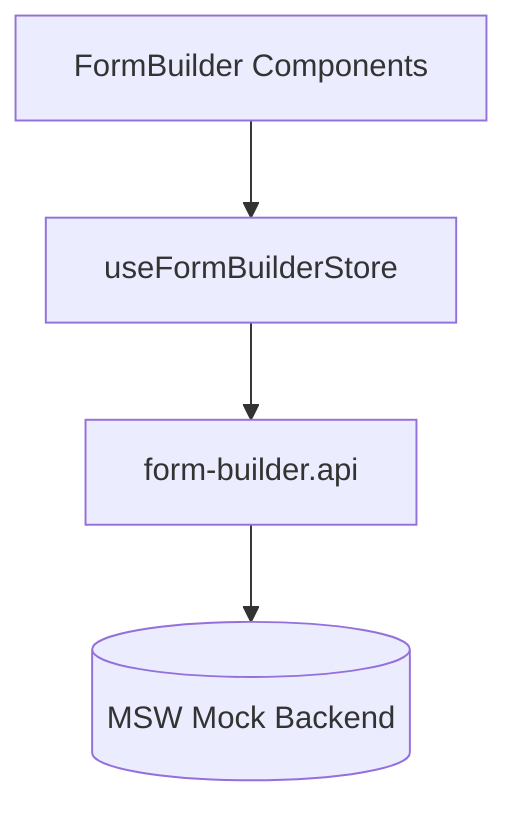

# 🧩 Módulo FormBuilder

Documento complementario que detalla la separación de responsabilidades del módulo FormBuilder.

## Objetivo
Centralizar la lógica de construcción dinámica de formularios (arrastrar, editar, persistir campos) sin acoplarla al CRUD base de formularios.

## Capas

1. Servicio (`src/services/form-builder.api.ts`)
   - Endpoints específicos de estructura: schema completo, fields CRUD, reorder, replace.
2. Mocks (`src/mocks/handlers/form-builder.handlers.ts`)
   - Implementación in-memory que reutiliza `forms.handlers.ts` para compartir el almacenamiento.
3. Estado (`src/state/formBuilder.store.ts`)
   - Mantiene `currentForm` + operaciones remotas y edición local.

## Flujo Típico

## Operaciones Clave
- loadForm(id)
- addField(field)
- updateField(fieldId, data)
- removeField(fieldId)
- reorderFields(order[])
- replaceSchema(schema)
- setLocalFields(fields) (optimista / aún no persistido)

## Motivos de la Separación
- Evitar crecimiento descontrolado del `useFormsStore`.
- Permitir caching / invalidación específica (futuro TanStack Query).
- Claridad conceptual entre "Form" (entidad) y "FormBuilder" (herramienta de composición).

## Próximas Mejores Prácticas
- Validación Zod para cada mutación antes de llamada remota.
- Sistema de versionado de schema.
- Flag `published` + endpoint de publicación.
- Undo/Redo local mediante un stack de estados en el store.

---
Este archivo debe actualizarse si se agregan nuevas operaciones o cambia el contrato del servicio FormBuilder.
