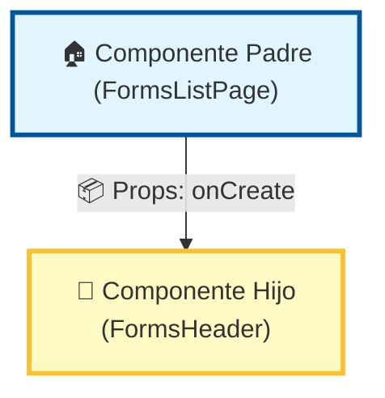
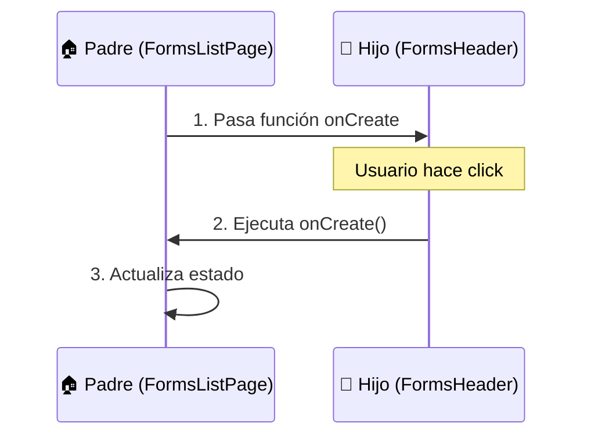
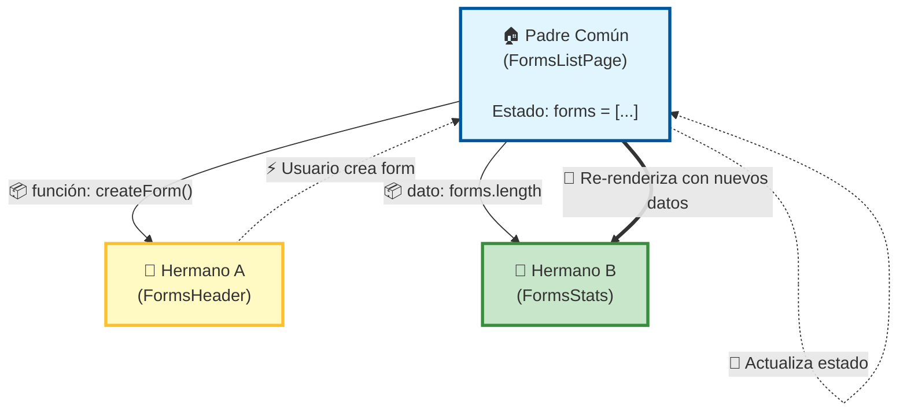
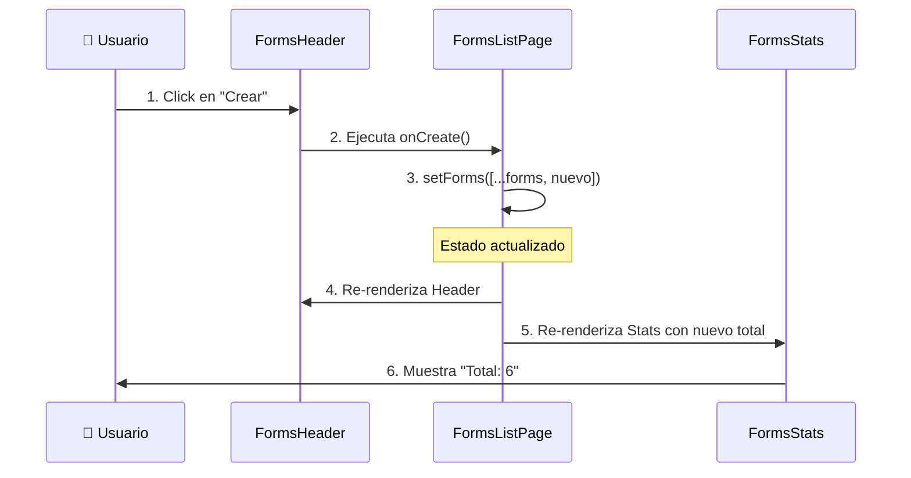
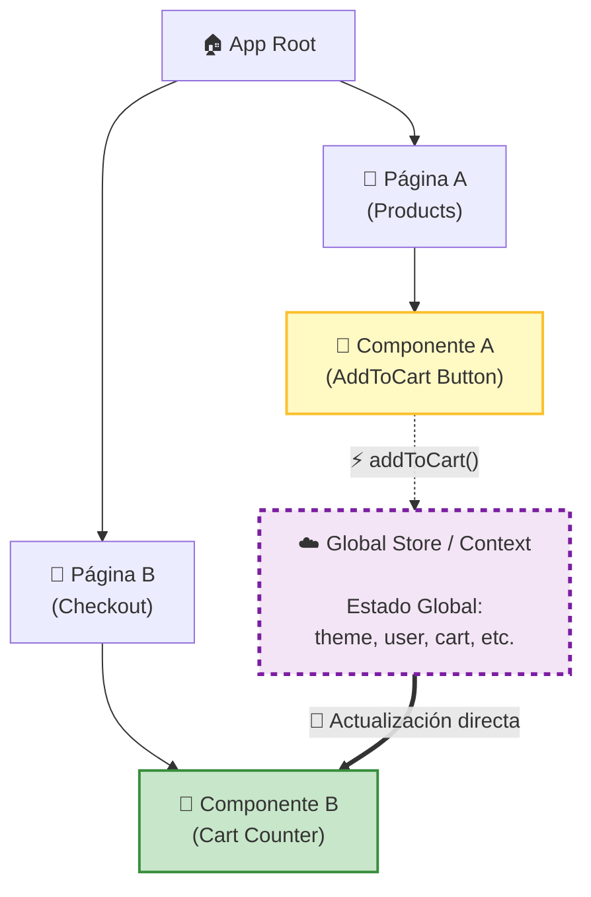
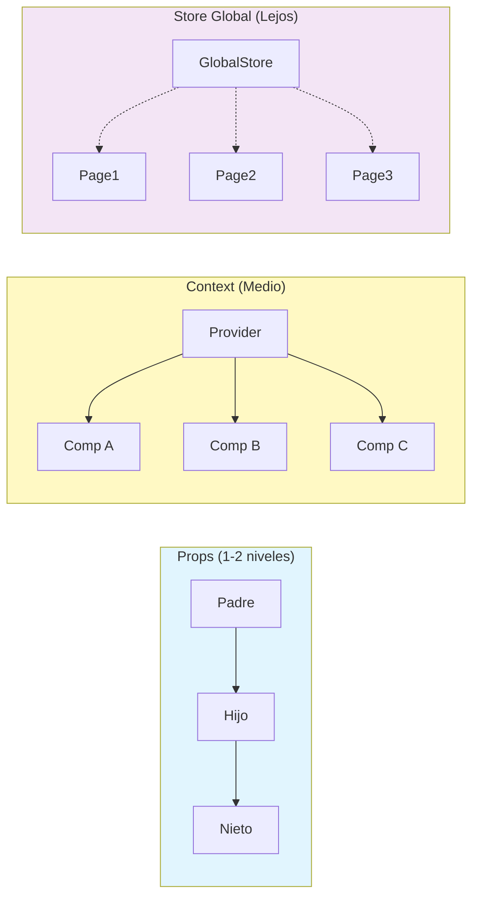
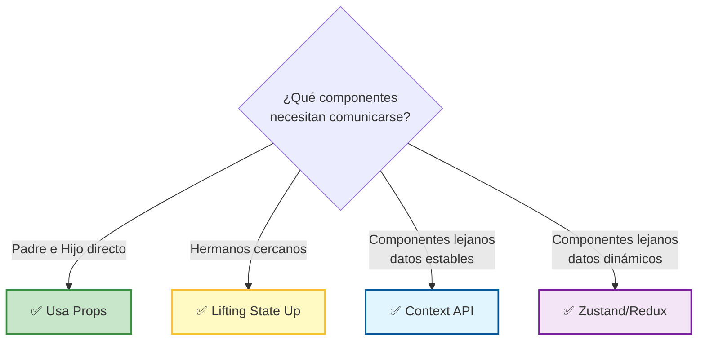

# Patrones de Comunicación entre Componentes en React

Este documento resume los patrones fundamentales para compartir información y eventos entre componentes en React. Entender estos flujos es clave para diseñar arquitecturas escalables y mantenibles.

---

## 📚 Tabla de Contenidos

1. [Padre a Hijo (Props)](#1-padre-a-hijo-parent---child)
2. [Hijo a Padre (Callbacks)](#2-hijo-a-padre-child---parent)
3. [Hermano a Hermano (Lifting State Up)](#3-hermano-a-hermano-sibling---sibling)
4. [Comunicación Profunda (Context/Store)](#4-comunicación-diagonal-o-profunda)

---

## 1. Padre a Hijo (Parent → Child)

### 🎯 El Problema

Necesitas que un componente hijo muestre información o ejecute comportamientos que vienen del componente padre.

### ✅ La Solución: Props (Propiedades)

Es la forma más básica y común. El componente padre es **dueño de los datos** y se los "presta" al hijo a través de atributos llamados `props`.

### 📊 Flujo de Datos



### 💻 Ejemplo de Código

**Componente Padre:**
```tsx
// FormsListPage.tsx
function FormsListPage() {
  const { createForm } = useFormsList();
  
  return (
    <div>
      {/* Pasando la función como prop */}
      <FormsHeader onCreate={createForm} />
    </div>
  );
}
```

**Componente Hijo:**
```tsx
// FormsHeader.tsx
interface FormsHeaderProps {
  onCreate: () => void; // Recibe la función como prop
}

function FormsHeader({ onCreate }: FormsHeaderProps) {
  return (
    <div>
      <h1>Formularios</h1>
      <Button onClick={onCreate}>
        Nuevo Formulario
      </Button>
    </div>
  );
}
```

### 📌 Características

*   **Dirección:** Unidireccional (Siempre hacia abajo).
*   **Uso:** Configurar componentes hijos, pasar datos para mostrar, compartir funciones.
*   **Ventaja:** Simple, predecible, fácil de rastrear.
*   **Limitación:** Solo funciona entre padre e hijo directo (1 nivel).

### 📖 Referencias

*   [Passing Props to a Component - React Docs](https://react.dev/learn/passing-props-to-a-component)

---

## 2. Hijo a Padre (Child → Parent)

### 🎯 El Problema

Un componente hijo necesita **notificar** al padre que algo sucedió (ej. un usuario hizo click en un botón, escribió en un input, etc.).

### ✅ La Solución: Callbacks (Funciones de Evento)

En React, los datos **NO pueden subir** directamente. La solución es que el padre le dé al hijo una **función callback**, y el hijo la ejecute cuando necesite comunicarse.

### 📊 Flujo de Datos



### 💻 Ejemplo de Código

**Componente Padre:**
```tsx
// FormsListPage.tsx
function FormsListPage() {
  const [forms, setForms] = useState([]);
  
  const handleCreate = () => {
    // Esta función se ejecutará cuando el hijo haga algo
    const newForm = { id: Date.now(), title: 'Nuevo' };
    setForms([...forms, newForm]);
  };
  
  return (
    <div>
      {/* El padre "presta" su función al hijo */}
      <FormsHeader onCreate={handleCreate} />
    </div>
  );
}
```

**Componente Hijo:**
```tsx
// FormsHeader.tsx
function FormsHeader({ onCreate }: { onCreate: () => void }) {
  return (
    <Button onClick={onCreate}>
      {/* Cuando hacen click, se ejecuta la función del padre */}
      Nuevo Formulario
    </Button>
  );
}
```

### 📌 Características

*   **Dirección:** Eventos hacia arriba (mediante funciones que bajan).
*   **Uso:** Manejar eventos del usuario (clicks, cambios, envíos de formularios).
*   **Ventaja:** El hijo no necesita conocer la lógica del padre, solo ejecuta la función.
*   **Patrón:** Los datos fluyen hacia abajo, los eventos fluyen hacia arriba.

### 📖 Referencias

*   [Responding to Events - React Docs](https://react.dev/learn/responding-to-events)

---

## 3. Hermano a Hermano (Sibling → Sibling)

### 🎯 El Problema

Tienes dos componentes al **mismo nivel** (hermanos) que necesitan compartir información, pero no se conocen entre sí.

**Ejemplo real:**
*   `FormsHeader` tiene un botón "Crear Formulario".
*   `FormsStats` muestra "Total de formularios: 5".
*   Cuando creas un formulario en `Header`, quieres que `Stats` se actualice automáticamente.

### ❌ ¿Por qué no pueden comunicarse directamente?

En React, los componentes solo pueden comunicarse a través de su jerarquía (padre-hijo). Dos hermanos están "aislados" entre sí.

### ✅ La Solución: Lifting State Up (Elevar el Estado)

**Mueve el estado compartido al padre común más cercano.** El padre se convierte en la "fuente única de verdad" y distribuye los datos a ambos hijos.

### 📊 Flujo de Datos



### 💻 Ejemplo de Código

**❌ Enfoque Incorrecto (Estado aislado en cada hijo):**
```tsx
// ❌ PROBLEMA: Cada componente tiene su propio estado
function FormsHeader() {
  const [count, setCount] = useState(0); // Estado local
  return <Button onClick={() => setCount(count + 1)}>Crear</Button>;
}

function FormsStats() {
  const [count, setCount] = useState(0); // Estado local diferente
  return <p>Total: {count}</p>; // ❌ No se sincroniza con Header
}
```

**✅ Enfoque Correcto (Estado elevado al padre):**
```tsx
// ✅ SOLUCIÓN: El padre tiene el estado compartido
function FormsListPage() {
  const [forms, setForms] = useState([]);
  
  const handleCreate = () => {
    setForms([...forms, { id: Date.now(), title: 'Nuevo' }]);
  };
  
  return (
    <div>
      {/* Hermano A recibe la función */}
      <FormsHeader onCreate={handleCreate} />
      
      {/* Hermano B recibe el dato */}
      <FormsStats total={forms.length} />
    </div>
  );
}

// Hermano A
function FormsHeader({ onCreate }: { onCreate: () => void }) {
  return <Button onClick={onCreate}>Crear Formulario</Button>;
}

// Hermano B
function FormsStats({ total }: { total: number }) {
  return <p>Total de formularios: {total}</p>;
}
```

### 🔄 Secuencia de Eventos



### 📌 Características

*   **Problema:** Componentes hermanos necesitan compartir datos.
*   **Solución:** Mover el estado al ancestro común más cercano.
*   **Ventaja:** Fuente única de verdad, sincronización automática.
*   **Cuándo usarlo:** Cuando los componentes están en la misma "página" o sección.

### 📖 Referencias

*   [Sharing State Between Components - React Docs](https://react.dev/learn/sharing-state-between-components)

---

## 4. Comunicación "Diagonal" o Profunda

### 🎯 El Problema

Necesitas compartir datos entre componentes que están **muy lejos** en el árbol de componentes, o en **ramas completamente diferentes**.

**Ejemplo real:**
*   Un botón en `ProductPage` agrega algo al carrito.
*   El contador del carrito está en `Navbar` (en la parte superior de la app).
*   `ProductPage` y `Navbar` están en ramas totalmente diferentes del árbol.

### ❌ ¿Por qué no usar Props?

Si usas props, tendrías que pasar los datos a través de MUCHOS componentes intermedios que no los necesitan. Esto se llama **"Prop Drilling"** y hace el código difícil de mantener.

```
App → Layout → Sidebar → Menu → MenuItem → ...
```

### ✅ Las Soluciones

#### A. Context API

Para datos **globales relativamente estables** (Tema, Idioma, Usuario autenticado).

#### B. Global Store (Zustand/Redux)

Para estados **complejos que cambian frecuentemente** (Carrito, Notificaciones, Estado de aplicación).

### 📊 Flujo de Datos (Context/Store)



### 💻 Ejemplo con Context API

```tsx
// 1. Crear el Context
import { createContext, useContext, useState } from 'react';

const ThemeContext = createContext();

// 2. Provider (envuelve toda la app)
function App() {
  const [theme, setTheme] = useState('light');
  
  return (
    <ThemeContext.Provider value={{ theme, setTheme }}>
      <Layout>
        <HomePage />
        <SettingsPage />
      </Layout>
    </ThemeContext.Provider>
  );
}

// 3. Consumir en cualquier componente (sin importar qué tan profundo esté)
function SettingsPage() {
  const { theme, setTheme } = useContext(ThemeContext);
  
  return (
    <Button onClick={() => setTheme(theme === 'light' ? 'dark' : 'light')}>
      Cambiar a {theme === 'light' ? 'oscuro' : 'claro'}
    </Button>
  );
}

// Este componente también puede acceder sin pasar props
function Navbar() {
  const { theme } = useContext(ThemeContext);
  
  return <nav className={theme}>...</nav>;
}
```

### 💻 Ejemplo con Zustand

```tsx
// 1. Crear el Store
import { create } from 'zustand';

const useCartStore = create((set) => ({
  items: [],
  addItem: (item) => set((state) => ({ 
    items: [...state.items, item] 
  })),
}));

// 2. Consumir en cualquier componente
function ProductPage() {
  const addItem = useCartStore((state) => state.addItem);
  
  return (
    <Button onClick={() => addItem({ id: 1, name: 'Laptop' })}>
      Agregar al Carrito
    </Button>
  );
}

// 3. En otro componente completamente diferente
function Navbar() {
  const items = useCartStore((state) => state.items);
  
  return <Badge>{items.length}</Badge>;
}
```

### 🔄 Comparación: Props vs Context vs Store



### 📌 Cuándo Usar Cada Uno

| Patrón | Distancia | Frecuencia de Cambio | Ejemplo |
|--------|-----------|----------------------|---------|
| **Props** | 1-2 niveles | Cualquiera | Pasar título a un botón |
| **Lifting State** | Hermanos cercanos | Media/Alta | Formulario y vista previa |
| **Context** | Cualquiera | Baja | Tema, Idioma, Usuario |
| **Zustand/Redux** | Cualquiera | Alta | Carrito, Estado de app |

### 📖 Referencias

*   [Passing Data Deeply with Context - React Docs](https://react.dev/learn/passing-data-deeply-with-context)
*   [Zustand Documentation](https://github.com/pmndrs/zustand)
*   [Redux Toolkit](https://redux-toolkit.js.org/)

---

## 🎓 Resumen Final



### 💡 Regla de Oro

**Empieza simple (Props), y solo aumenta la complejidad cuando realmente lo necesites.**

1.  **Props:** Tu opción por defecto.
2.  **Lifting State:** Cuando dos hermanos necesitan compartir.
3.  **Context:** Cuando muchos componentes necesitan lo mismo (tema, usuario).
4.  **Store Global:** Cuando la app crece y el estado se vuelve complejo.
